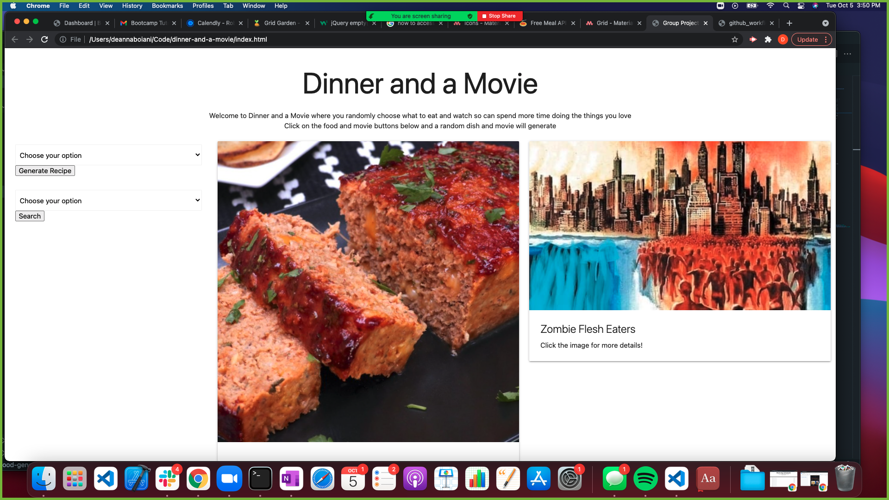

# <Dinner-and-a-Movie>

## Description
Have ever been at home on a friday night or have a date night and don't know what to eat and watch? Well, Dinner and a Movie is here to help. Our application will help you by generating a random meal and movie so you more time doing the things you love rather than just deciding. 

- The motivation for this project was to learn how to develop in a collaborative environment and also to implement the skills we have been learning in fetching data from external API's.
- This project resolves the problem of not being able to decide what to cook and what to watch.
- We learned how to collaborate on Github while working separately on certain aspects of the page. We also learned how to work with multiple API's to build one cohesive application.  

## Table of Contents 
If your README is long, add a table of contents to make it easy for users to find what they need.
- [Installation](#installation)
- [Usage](#usage)
- [Credits](#credits)

## Installation
The project can be accessed by clicking [this link](https://deannaboiani.github.io/dinner-and-a-movie/)
## Usage
The user can click the buttons displayed to generate a random meal and movie. They can also use dropdown filters to narrow the possible results. The user can choose to generate a new meal or movie if they are not happy with the result of either.

    

## Credits
Credits to the Dinner and a Movie Team: DeAnna Boiani, Jorge Barragan, Minhvan Le, and Stephanie Turner. Credits to the [TMDB API](https://www.themoviedb.org/documentation/api?language=en-US) and [the Meal DB API](https://www.themealdb.com/api.php), [Materialize CSS](https://materializecss.com/grid.html). Credits also to the Coding Bootcamp instructors, and TA's.    
## Features
Our project features include, generating a random movie or meal separately as well as both at the same time. Another feature is the dropdown search filters.
## Tests
Testing was done by the team directly on the page. 